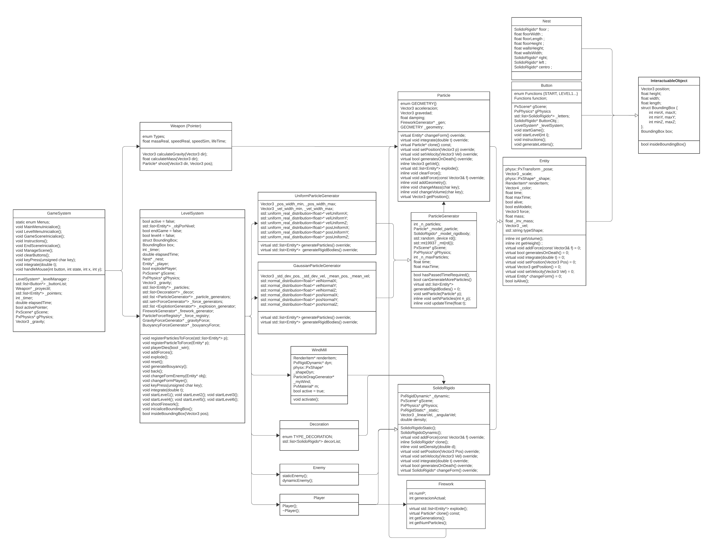
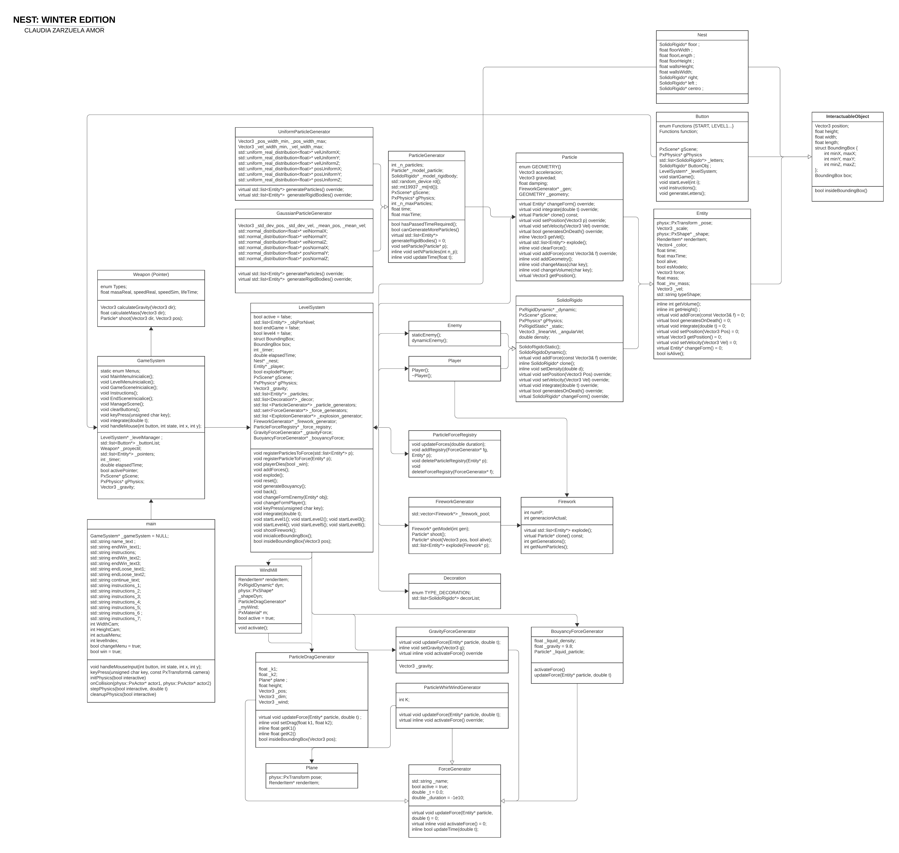

# SimulacionFisicaVideojuegos
Repositorio de las prácticas de la asignatura de Simulación Física de Videojuegos

En la carpeta skeleton estará vuestro código fuente

Necesitaréis además descomprimir el archivo que se indica a continuación en la raíz del repositorio:

Carpetas bin y common https://ucomplutense-my.sharepoint.com/:u:/g/personal/davalejo_ucm_es/EZcsdyIoqTFOrF4hdfkVYk0BJZ9IycJ3QqXQFwaXVrlSKg?e=pfs6IO

# UML completo

# UML de partículas y sólidos rígidos

